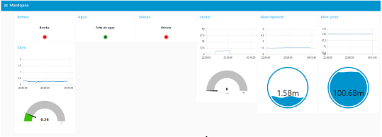

# Remote Monitoring of Water Pumping Stations with LoRaWAN and Siemens PLCs

## Overview

This project presents an industrial IoT solution for the remote monitoring of water pumping stations connected to the supply system of Vitoria-Gasteiz. The system was designed to centralize the supervision of geographically distributed stations, improve incident response, reduce manual inspections, and provide near real-time visibility of critical operating variables.

  

The architecture combines industrial control hardware and lightweight communication technologies: Siemens S7-1200 PLCs for signal acquisition, Modbus RTU for local communication, Dragino RS485-LN devices for LoRaWAN transmission, The Things Network (TTN) as the network server, MQTT for message transport, Node-RED for monitoring dashboards, and ThingSpeak for cloud visualization and data analysis.

This repository is structured as a portfolio-oriented reconstruction of a real engineering project developed during my internship, with the goal of documenting the technical architecture, design decisions, implementation logic, and lessons learned in a professional and accessible way.

## Problem Statement

Water pumping and storage stations are often distributed across wide geographical areas and contain critical equipment such as pumps, level sensors, pressure sensors, and chlorine measurement devices. Monitoring these assets only through local systems or in-person inspections limits operational visibility and slows down reaction times when faults occur.

The challenge of this project was to design a communication and monitoring system capable of:

- Collecting signals from remote stations.
- Sending the data reliably over long distances.
- Integrating industrial equipment with IoT communication layers.
- Visualizing the information from a central point.
- Keeping the system scalable for future station additions.

## Objectives

The main objectives of the project were:

- Centralize the monitoring of several remote water stations.
- Capture digital and analog signals from industrial field devices.
- Transmit relevant data through a low-power long-range network.
- Make the information available in a supervisory interface.
- Support future integration with SCADA environments.
- Define a reusable communication structure for multiple stations.

## System Architecture

The solution follows an edge-to-cloud industrial IoT architecture:

1. **Signal acquisition at station level** using Siemens S7-1200 PLCs.
2. **Local industrial communication** through Modbus RTU over RS485.
3. **Wireless long-range transmission** using Dragino RS485-LN LoRaWAN converters.
4. **Network management** through The Things Network (TTN).
5. **Data transport and processing** using MQTT and Node-RED.
6. **Visualization and cloud analytics** through Node-RED dashboards and ThingSpeak.

In practical terms, each remote station gathers process variables such as pump status, fault signals, tank level, pressure, flow, or chlorine values. These variables are mapped inside the PLC, exposed through Modbus registers, read by the LoRaWAN communication device, transmitted to TTN, and then forwarded to dashboards and cloud services for centralized supervision.

## Main Technologies Used

- **Siemens S7-1200 PLC**
- **Modbus RTU / RS485**
- **Dragino RS485-LN**
- **LoRa / LoRaWAN**
- **The Things Network (TTN)**
- **MQTT**
- **Node-RED**
- **ThingSpeak**

## Engineering Requirements

Several technical criteria guided the design of the solution:

- **Long-range communication** suitable for geographically distributed infrastructure.
- **Low deployment cost** compared with more complex communication alternatives.
- **Industrial robustness** through the use of PLC-based acquisition.
- **Support for multiple stations** under a common monitoring strategy.
- **Periodic updates** with a refresh objective of a few minutes.
- **Scalability** so that the same architecture could be extended to additional remote sites.
- **Interoperability** with supervisory and industrial software environments.

## Example Variables Monitored

Depending on the station, the monitored variables could include:

- Pump running status.
- Pump fault status.
- Tank level.
- Well level.
- Suction or line pressure.
- Flow rate.
- Chlorine concentration.

This combination of digital and analog variables made it possible to obtain a clearer picture of the operational state of each remote installation.

  

## My Contribution

In this project, my work focused on the engineering and integration aspects of the solution. My contribution included tasks such as:

- Understanding the operational needs of the remote stations.
- Defining the general communication architecture.
- Participating in signal mapping and data structuring.
- Working with PLC-based acquisition logic.
- Integrating Modbus and LoRaWAN communication layers.
- Configuring the data flow toward TTN, MQTT, and Node-RED.
- Designing monitoring dashboards.
- Supporting testing and validation in real stations.

## Results

The project demonstrated the feasibility of building a remote monitoring architecture for water infrastructure using a combination of industrial automation and IoT technologies. The proposed solution enabled centralized access to relevant field data, reduced dependence on local-only supervision, and established a foundation for future expansion to additional stations.

Beyond the specific technical implementation, the project was valuable as an exercise in industrial systems integration: it required connecting field instrumentation, PLC logic, industrial protocols, wireless communication, cloud services, and visualization tools into one coherent workflow.

## Repository Purpose

This repository is not intended to expose confidential operational details, credentials, or production configurations. Instead, it serves as a technical portfolio project that documents:

- The problem addressed.
- The architecture selected.
- The engineering logic behind the solution.
- The technologies involved.
- The lessons that can be generalized to similar industrial IoT use cases.

## Limitations and Future Improvements

A next iteration of the project could include:

- A simulation environment to reproduce telemetry without the original hardware.
- Sanitized Node-RED flows for demonstration.
- A clearer digital twin of the stations.
- Alarm management rules.
- Historical trend analysis.
- A lightweight demo dashboard reproducible from this repository.

## Skills Demonstrated

This project showcases skills in:

- Industrial automation.
- IoT system design.
- Communication protocols.
- Edge-to-cloud architectures.
- Remote monitoring.
- Dashboard development.
- Technical documentation.
- Engineering problem solving.

## Disclaimer

This repository is a portfolio-oriented reconstruction based on a real internship project. Sensitive operational details, credentials, and internal configuration data are intentionally omitted or sanitized.

---

# Monitorización remota de estaciones de bombeo de agua con LoRaWAN y PLCs Siemens

## Descripción general

Este proyecto presenta una solución de IoT industrial para la monitorización remota de estaciones de bombeo de agua conectadas al sistema de abastecimiento de Vitoria-Gasteiz. El sistema fue diseñado para centralizar la supervisión de estaciones distribuidas geográficamente, mejorar la capacidad de respuesta ante incidencias, reducir las inspecciones manuales y ofrecer visibilidad casi en tiempo real de variables operativas críticas.

La arquitectura combina hardware de control industrial y tecnologías de comunicación ligeras: PLCs Siemens S7-1200 para la adquisición de señales, Modbus RTU para la comunicación local, dispositivos Dragino RS485-LN para la transmisión LoRaWAN, The Things Network (TTN) como servidor de red, MQTT para el transporte de mensajes, Node-RED para los paneles de monitorización y ThingSpeak para la visualización en la nube y el análisis de datos.

Este repositorio está planteado como una reconstrucción orientada a portfolio de un proyecto real de ingeniería desarrollado durante mis prácticas, con el objetivo de documentar la arquitectura técnica, las decisiones de diseño, la lógica de implementación y los aprendizajes obtenidos de una forma profesional y accesible.

## Planteamiento del problema

Las estaciones de bombeo y almacenamiento de agua suelen estar distribuidas en áreas geográficas amplias y contienen equipos críticos como bombas, sensores de nivel, sensores de presión y dispositivos de medición de cloro. Monitorizar estos activos únicamente mediante sistemas locales o inspecciones presenciales limita la visibilidad operativa y ralentiza la respuesta cuando aparecen fallos.

El reto de este proyecto fue diseñar un sistema de comunicación y monitorización capaz de:

- Recoger señales de estaciones remotas.
- Enviar los datos de forma fiable a larga distancia.
- Integrar equipos industriales con capas de comunicación IoT.
- Visualizar la información desde un punto central.
- Mantener el sistema escalable para futuras incorporaciones de estaciones.

## Objetivos

Los objetivos principales del proyecto fueron:

- Centralizar la monitorización de varias estaciones remotas de agua.
- Capturar señales digitales y analógicas de dispositivos industriales de campo.
- Transmitir datos relevantes mediante una red de largo alcance y bajo consumo.
- Poner la información a disposición de una interfaz de supervisión.
- Facilitar una futura integración con entornos SCADA.
- Definir una estructura de comunicación reutilizable para múltiples estaciones.

## Arquitectura del sistema

La solución sigue una arquitectura edge-to-cloud de IoT industrial:

1. **Adquisición de señales a nivel de estación** mediante PLCs Siemens S7-1200.
2. **Comunicación industrial local** mediante Modbus RTU sobre RS485.
3. **Transmisión inalámbrica de largo alcance** usando convertidores LoRaWAN Dragino RS485-LN.
4. **Gestión de red** a través de The Things Network (TTN).
5. **Transporte y procesamiento de datos** con MQTT y Node-RED.
6. **Visualización y analítica en la nube** mediante paneles de Node-RED y ThingSpeak.

En términos prácticos, cada estación remota recopila variables de proceso como el estado de bombas, señales de fallo, nivel de depósito, presión, caudal o valores de cloro. Estas variables se mapean dentro del PLC, se exponen mediante registros Modbus, son leídas por el dispositivo de comunicación LoRaWAN, se transmiten a TTN y posteriormente se envían a paneles de monitorización y servicios cloud para su supervisión centralizada.

## Tecnologías principales utilizadas

- **Siemens S7-1200 PLC**
- **Modbus RTU / RS485**
- **Dragino RS485-LN**
- **LoRa / LoRaWAN**
- **The Things Network (TTN)**
- **MQTT**
- **Node-RED**
- **ThingSpeak**

## Requisitos de ingeniería

Varios criterios técnicos guiaron el diseño de la solución:

- **Comunicación de largo alcance** adecuada para infraestructuras distribuidas geográficamente.
- **Bajo coste de despliegue** en comparación con otras alternativas de comunicación más complejas.
- **Robustez industrial** gracias al uso de adquisición basada en PLC.
- **Soporte para múltiples estaciones** bajo una estrategia común de monitorización.
- **Actualizaciones periódicas** con un objetivo de refresco de unos pocos minutos.
- **Escalabilidad** para extender la misma arquitectura a nuevas estaciones remotas.
- **Interoperabilidad** con entornos de supervisión y software industrial.

## Ejemplos de variables monitorizadas

Dependiendo de la estación, las variables monitorizadas podían incluir:

- Estado de marcha de bombas.
- Estado de fallo de bombas.
- Nivel de depósito.
- Nivel de pozo.
- Presión de aspiración o de línea.
- Caudal.
- Concentración de cloro.

Esta combinación de variables digitales y analógicas permitía obtener una visión más clara del estado operativo de cada instalación remota.

## Mi contribución

En este proyecto, mi trabajo se centró en los aspectos de ingeniería e integración de la solución. Mi contribución incluyó tareas como:

- Comprender las necesidades operativas de las estaciones remotas.
- Definir la arquitectura general de comunicaciones.
- Participar en el mapeo de señales y en la estructuración de datos.
- Trabajar con la lógica de adquisición basada en PLC.
- Integrar las capas de comunicación Modbus y LoRaWAN.
- Configurar el flujo de datos hacia TTN, MQTT y Node-RED.
- Diseñar paneles de monitorización.
- Dar soporte a las pruebas y validaciones en estaciones reales.

## Resultados

El proyecto demostró la viabilidad de construir una arquitectura de monitorización remota para infraestructuras hidráulicas mediante una combinación de automatización industrial y tecnologías IoT. La solución propuesta permitió acceder de forma centralizada a datos relevantes de campo, redujo la dependencia de una supervisión exclusivamente local y sentó una base para futuras ampliaciones a más estaciones.

Más allá de la implementación técnica concreta, el proyecto fue especialmente valioso como ejercicio de integración de sistemas industriales: exigió conectar instrumentación de campo, lógica PLC, protocolos industriales, comunicación inalámbrica, servicios cloud y herramientas de visualización dentro de un mismo flujo coherente.

## Propósito del repositorio

Este repositorio no pretende exponer detalles operativos confidenciales, credenciales ni configuraciones de producción. En su lugar, funciona como un proyecto técnico de portfolio que documenta:

- El problema abordado.
- La arquitectura seleccionada.
- La lógica de ingeniería detrás de la solución.
- Las tecnologías implicadas.
- Los aprendizajes que pueden generalizarse a casos de uso similares de IoT industrial.

## Limitaciones y futuras mejoras

Una siguiente iteración del proyecto podría incluir:

- Un entorno de simulación para reproducir telemetría sin depender del hardware original.
- Flujos de Node-RED saneados para demostración.
- Un gemelo digital más claro de las estaciones.
- Reglas de gestión de alarmas.
- Análisis histórico de tendencias.
- Un dashboard demo ligero y reproducible desde este repositorio.

## Competencias demostradas

Este proyecto muestra competencias en:

- Automatización industrial.
- Diseño de sistemas IoT.
- Protocolos de comunicación.
- Arquitecturas edge-to-cloud.
- Monitorización remota.
- Desarrollo de dashboards.
- Documentación técnica.
- Resolución de problemas de ingeniería.

## Nota

Este repositorio es una reconstrucción orientada a portfolio basada en un proyecto real de prácticas. Los detalles operativos sensibles, las credenciales y los datos internos de configuración han sido omitidos o saneados de forma intencionada.
