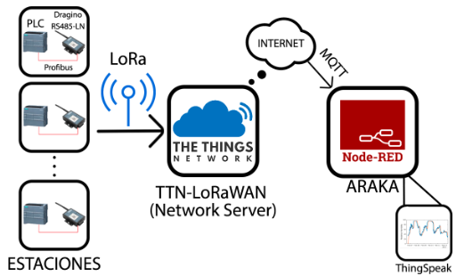
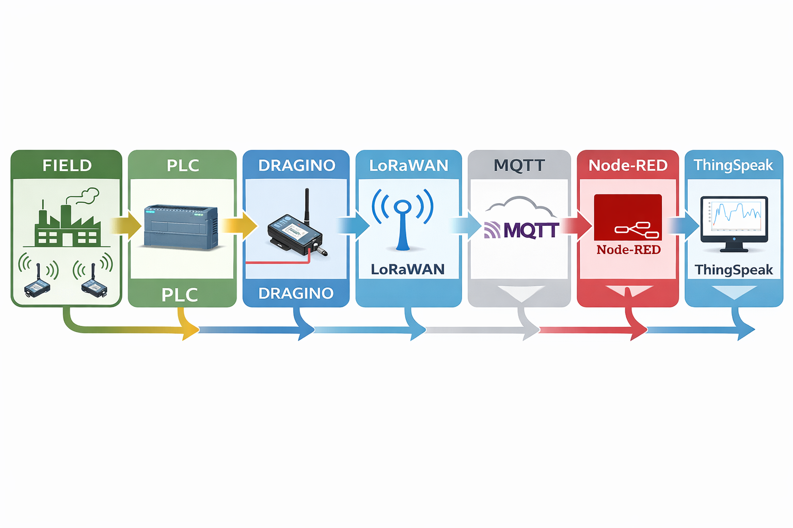
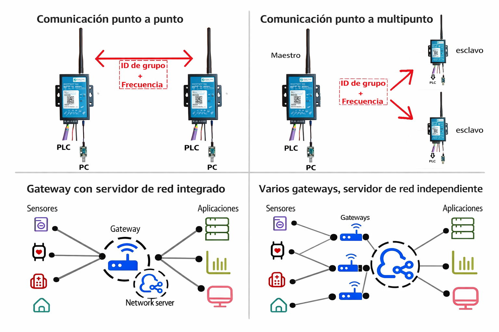
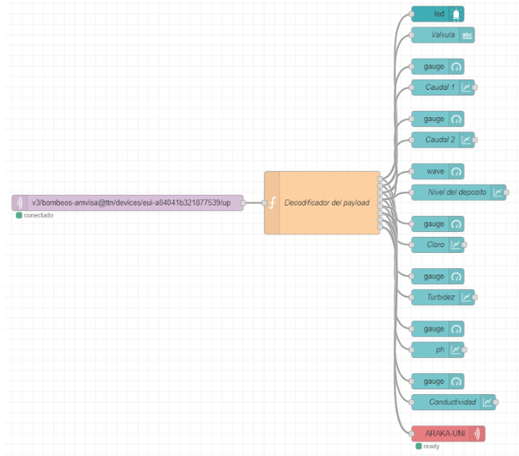

# Architecture

## Purpose of This Architecture

The architecture of this project was designed to solve a practical industrial problem: how to collect operational data from geographically distributed water pumping stations and make that information available at a centralized monitoring point without relying on constant on-site supervision.

From a portfolio perspective, the value of the architecture lies in the integration of industrial control hardware, long-range wireless communications, IoT network services, message-based processing, and remote visualization into a single coherent monitoring pipeline.

---

## Architectural Summary

At a high level, the system follows this chain:

**Pumping station signals → Siemens PLC → RS-485 / Modbus → Dragino RS485-LN → LoRaWAN → TTIG gateway → TTN → MQTT → Node-RED in Araka → ThingSpeak**

  

<em>End-to-end architecture of the remote water pumping monitoring system.</em>

This architecture transforms field-level operational data into remotely accessible monitoring dashboards and cloud-stored telemetry.

## Why This Architecture Was Chosen

The system architecture was shaped by a set of practical design requirements:

* Long-distance communication with low operating cost
* Use of industrial-grade hardware
* Centralized supervision of multiple remote stations
* Compatibility with an existing SCADA context
* Acceptable refresh times for operational monitoring
* Support for both digital and analog signals
* Robustness in industrial environments
* Scalability for future station additions

Rather than optimizing for maximum throughput, the architecture was optimized for reliability, range, simplicity, and maintainability in a distributed water infrastructure context.

---

## High-Level Layered View

The solution can be understood as six connected layers.

### 1. Field Layer

Each pumping station contains the local process signals that need to be monitored, such as pump status, fault signals, tank levels, pressures, flow-related variables, or water-quality-related values depending on the site.

These signals originate in the physical process and represent the operational state of each remote asset.

### 2. Control and Acquisition Layer

A Siemens S7-1214 PLC is used at each monitored station as the local acquisition and control device.

Its role in the architecture is to:

* Read the available digital and analog signals
* Organize them into a consistent internal structure
* Expose the selected values for external communication
* Serve as the industrial interface between the process and the telemetry chain

A CM 1241 communication module extends the PLC with RS-422/485 communication capability, enabling the serial communication link used in the project.

### 3. Edge Communication Conversion Layer

The Dragino RS485-LN acts as the bridge between industrial serial communications and wireless IoT transmission.

This is a key architectural decision. Instead of replacing the industrial control layer with native IoT devices, the project preserves the PLC-based logic and adds a conversion layer that:

* Queries the PLC over Modbus RTU
* Receives the requested register data
* Prepares the payload to be transmitted
* Sends that payload through LoRaWAN

In the local Modbus network, the Dragino module behaves as the master and the PLC behaves as the slave.

### 4. Long-Range Wireless Network Layer

Once the data has been extracted from the PLC, it is transmitted over LoRaWAN.

This communication layer was chosen because it provides:

* Long-range coverage
* Low energy and low operating cost characteristics
* Suitability for geographically distributed infrastructure
* An architecture that can grow to support additional stations

The project was not structured as a simple point-to-point LoRa link. Instead, it adopted a **LoRaWAN architecture with an independent network server**, which is more appropriate for centralized supervision and future expansion.

### 5. Network and Messaging Layer

The wireless traffic is received by a TTIG gateway and forwarded to The Things Network (TTN), which acts as the LoRaWAN network server.

At this stage, TTN is responsible for:

* Receiving uplinks from the gateway
* Managing registered end devices
* Routing the received data
* Serving as the network-level intermediary between field devices and upper-layer applications

Once the data reaches TTN, it is forwarded through MQTT toward the central processing environment.

This makes MQTT the transport mechanism between the LoRaWAN side of the architecture and the data-processing side.

### 6. Processing, Visualization, and Storage Layer

Node-RED, running in the Araka environment with Orange Pi support, receives the MQTT messages and becomes the operational presentation layer of the system.

Its functions include:

* Payload reception
* Data decoding and transformation
* Routing values to dashboard widgets
* Presenting real-time process information to operators

After processing in Node-RED, the data is also sent to ThingSpeak for:

* Historical storage
* Graphical analysis
* Alarm-oriented monitoring
* Additional cloud-based visualization

This creates a two-level consumption model:

* **Node-RED** for operational monitoring and dashboard interaction
* **ThingSpeak** for storage, trends, and extended analysis

---

## End-to-End Data Path

  

<em>Functional decomposition of the architecture from field acquisition to cloud visualization.</em>

The complete architectural flow can be described step by step:

1. Process variables are read at the pumping station.
2. The PLC acquires and organizes the local signals.
3. The CM 1241 enables serial communication with the Dragino RS485-LN.
4. The Dragino module requests data through Modbus RTU.
5. The resulting values are packaged into a LoRaWAN payload.
6. The payload is transmitted wirelessly.
7. The TTIG gateway receives the radio message.
8. TTN manages the LoRaWAN network-level handling.
9. Data is forwarded through MQTT.
10. Node-RED receives, decodes, and visualizes the values.
11. Processed data is also published to ThingSpeak for storage and analysis.

---

## Architecture Diagram by Functional Blocks

A useful way to explain the system in interviews is to group the architecture into the following functional blocks:

* **Acquisition block:** PLC + local signals
* **Conversion block:** CM 1241 + Dragino RS485-LN
* **Transmission block:** LoRa / LoRaWAN + gateway
* **Network block:** TTN
* **Processing block:** MQTT + Node-RED
* **Analytics block:** ThingSpeak

This framing makes the architecture easier to communicate than describing it only as a list of devices.

---

## Why a LoRaWAN Network Server Architecture Instead of Simpler LoRa Modes

  

<em>Comparison of LoRa connectivity approaches considered during the architectural design.</em>

The original design space included different LoRa connectivity models, such as point-to-point, point-to-multipoint, a gateway with an embedded network server, and a LoRaWAN network with an independent network server.

For this project, the independent network server approach was the most suitable because it offers:

* Centralized network management
* Better scalability when adding more stations
* Easier remote supervision and maintenance
* Clearer separation between field devices, gateways, and application logic

That choice fits the project better than direct LoRa links because the main goal is not just transmission, but structured centralized monitoring across multiple remote assets.

---

## Why Node-RED Was Architecturally Important

  

<em>Node-RED as the processing and visualization layer in the central monitoring environment.</em>

Node-RED is not just a dashboard tool in this project. It is an integration layer.

This is especially important because the monitoring point in Araka had practical constraints related to the existing SCADA context. Instead of relying on a direct internet-connected PLC integration in the central environment, Node-RED provided a flexible software layer capable of:

* Receiving MQTT data from TTN
* Decoding incoming payloads
* Building monitoring dashboards quickly
* Adapting the visualization to each station
* Acting as a bridge between incoming telemetry and operator-facing supervision

Because of that, Node-RED should be understood as a core architectural component rather than as a secondary visualization add-on.

---

## Role of Orange Pi in the Architecture

The Orange Pi 3 LTS is the support computing platform that keeps Node-RED continuously available.

Its role is operational rather than conceptual, but it is still important in the architecture because it gives the processing and dashboard layer a dedicated execution environment.

That means the architecture does not stop at cloud messaging. It also includes a persistent local processing node capable of receiving, transforming, and presenting live telemetry.

---

## Support for Multiple Stations

The architecture was conceived for several pumping stations across the Vitoria-Gasteiz water supply system, while the pilot validation focused on a smaller subset.

Architecturally, this matters because the design was not built around a single asset. It was built around a repeatable station pattern:

* One local acquisition setup per station
* One wireless telemetry path per station
* One centralized monitoring environment for all incoming data

This repeatability is one of the strongest portfolio aspects of the project because it shows that the architecture can be replicated instead of remaining tied to a single isolated installation.

---

## Architecture and Design Requirements Alignment

The architecture addresses the main design requirements in the following way:

### Long-range, low-cost communication

LoRaWAN provides the long-range wireless layer without requiring expensive communications infrastructure.

### Industrial robustness

The use of Siemens PLC hardware and industrial communication modules preserves reliability at the field level.

### SCADA-friendly integration

Node-RED provides a practical software layer for centralized supervision and dashboard-based monitoring.

### Simultaneous monitoring of multiple stations

TTN and MQTT-based message routing support the centralized reception of data from several remote locations.

### Acceptable refresh intervals

The architecture supports intermediate update cycles suitable for operational monitoring rather than ultra-low-latency closed-loop control.

### Sufficient signal capacity

The PLC-based acquisition layer supports multiple digital and analog variables depending on the station.

### Scalability

New stations can be incorporated by repeating the station-side acquisition and communication pattern without redesigning the full central architecture.

---

## Strengths of the Architecture

The strongest aspects of the architecture are:

* Clear separation of concerns between acquisition, transmission, network management, processing, and visualization
* Reuse of industrial hardware already suited to the environment
* Centralized monitoring for geographically distributed assets
* Scalability beyond the pilot deployment
* Practical integration of OT and IoT layers
* Combination of operational dashboards and historical cloud analytics

---

## Main Limitations

This portfolio version should also be honest about architectural limitations.

Some relevant limitations are:

* The system is designed for monitoring, not for high-speed control loops
* Dependence on TTN introduces reliance on an external public network service in the pilot architecture
* Node-RED is flexible, but it is not the same as a hardened enterprise SCADA stack
* Cybersecurity hardening can be expanded significantly in future iterations

Mentioning these limits improves the credibility of the portfolio because it shows engineering judgment rather than overselling the solution.

## Conclusion

The architecture of this project is best understood as an industrial telemetry system that connects remote pumping stations with a centralized monitoring environment through a layered OT/IoT pipeline.

Its engineering value does not come from using a single technology in isolation, but from combining PLC-based acquisition, serial industrial communications, LoRaWAN networking, MQTT messaging, Node-RED dashboards, and ThingSpeak analytics into a practical and scalable solution for distributed infrastructure monitoring.

---

## What Comes Next

After the architecture, the next document should explain the devices, interfaces, and protocol choices in more detail.

Continue with: [`hardware-and-communications.md`](hardware-and-communications.md)

---

## Navigation

* Back to the [English documentation index](README.md)
* Back to [Project Overview](project-overview.md)
* Switch to the [Spanish version](../es/architecture.md)
