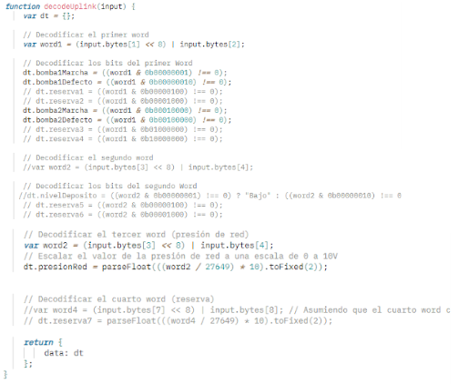
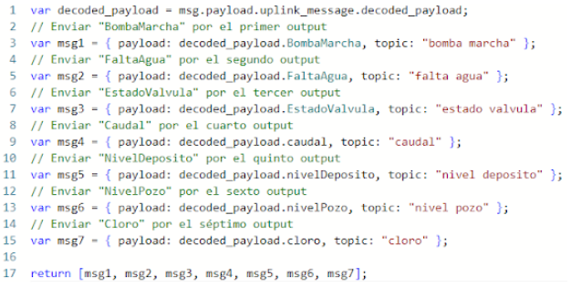

# Data Flow

## Purpose of This Document

This document explains how data moves through the system, from field signals inside the pumping stations to the final dashboards and cloud-based storage layer.

In a portfolio project like this one, the data flow is one of the most important parts to explain clearly. It shows not only which devices were used, but also how raw industrial signals were transformed into usable operational information.

---

## High-Level Data Flow Summary

At a high level, the project follows this logic:

**field signals → PLC data blocks → Modbus RTU polling → Dragino payload generation → LoRaWAN uplink → TTN reception → payload decoding → MQTT delivery → Node-RED routing → ThingSpeak storage and analysis**

This chain turns scattered station variables into a centralized monitoring stream that can be visualized and analyzed remotely.

---

## Recommended Main Figure

This image should appear near the top of the page, just after the high-level summary.

```md
<p align="center">
  
</p>
<p align="center"><em>Figure 1. End-to-end data flow from field acquisition to centralized visualization and storage.</em></p>
```

---

## What the Flow Needs to Achieve

The data pipeline was designed to satisfy a practical monitoring requirement rather than a purely theoretical communication exercise.

The flow had to:

* Collect both digital and analog variables from remote stations
* Preserve a consistent internal structure between stations
* Transmit only the useful information through a constrained long-range wireless link
* Transform the received payload into readable process values
* Route data to dashboards for operators
* Store the information for later analysis and alarm handling
* Support more than one station with a repeatable pattern

Because of that, the data flow is not only about transmission. It is about **structuring, reducing, decoding, and distributing information efficiently**.

---

## Step 1. Field Signal Acquisition

The data flow begins inside each pumping station with the acquisition of operational variables.

Depending on the station, these variables can include:

* Pump running status
* Pump fault status
* Tank level conditions
* Valve status
* Water shortage alarms
* Network or suction pressure
* Well level
* Tank level
* Flow rate
* Chlorine-related values

These are the real process signals that operators care about. At this stage, the information is still tied directly to physical equipment and instrumentation.

---

## Step 2. PLC Data Structuring

After acquisition, the PLC does not simply expose a random collection of signals. Instead, the monitored variables are arranged into a consistent internal data format.

This is an important design decision because it makes later processing much easier.

The general structure described for the stations is organized into **4 words**:

### First 2 words: digital inputs

* **Word 1** contains the main digital states
* **Word 2** is reserved for future extensions

A typical allocation includes:

* Pump 1 running / fault bits
* Pump 2 running / fault bits
* Tank level high / low bits
* Spare bits for future use

### Next 2 words: analog inputs

* **Word 3** contains the first analog value of interest
* **Word 4** is reserved or used for future analog expansion depending on the station

This structure gives the system a uniform internal model even when individual stations have different real signals.

---

## Why the PLC Data Format Matters

A strong portfolio explanation should make this point explicit:

The project does not only transmit data. It first **standardizes** data.

That standardization provides several advantages:

* Simpler Modbus access
* Easier byte selection for payload creation
* More predictable decoding logic in TTN
* Simpler flow design in Node-RED
* Easier scalability when new stations are added

Without this structured PLC-side format, the rest of the telemetry chain would become much harder to maintain.

---

## Example of Station-Level Signal Mapping

Although the project uses a shared structure, each station has its own practical signal mapping.

A clear example is **Mandojana**, where the monitored values include:

### Digital signals

* Pump running
* Water shortage alarm
* Valve closed
* Valve open

### Analog signals

* Well level
* Tank level
* Flow
* Chlorine

Other stations use simpler combinations, often focused on pump state and pressure, while some also include tank level signals.

This means the flow is standardized at structure level, but still flexible enough to represent different station realities.

---

## Suggested Data-Format Figure

Place this image after the PLC data structuring section.

```md
<p align="center">
  
</p>
<p align="center"><em>Figure 2. Example of the PLC-side word and bit organization used to standardize station data.</em></p>
```

---

## Step 3. Modbus RTU Polling Between Dragino and PLC

Once the PLC data is organized, the Dragino RS485-LN retrieves it through **Modbus RTU** over **RS-485**.

At this stage, the local flow works with a master-slave communication model:

* the **Dragino RS485-LN** acts as the master
* the **PLC** acts as the slave

This means the data exchange is initiated by the Dragino. It sends predefined requests to the PLC asking for the relevant registers, and the PLC returns the requested values.

In practical terms, this stage converts the PLC memory model into a serial response that can later become a wireless payload.

### What happens in this stage

1. The Dragino sends a Modbus request.
2. The PLC returns the requested register values.
3. The Dragino receives the serial response.
4. The useful bytes are selected for transmission.

This is the first place where the raw station information becomes an explicit telemetry message candidate.

---

## Step 4. Payload Preparation in the Dragino RS485-LN

The Dragino does more than forward serial data blindly.

A key part of the data flow is that the Dragino can be configured to:

* Send predefined Modbus commands
* Process the returned response
* Select only the relevant bytes
* Build the payload that will be sent to the LoRaWAN server

This is a very important efficiency step.

Instead of sending large blocks with empty or irrelevant content, the project trims the information so that only the useful bytes are transmitted. That reduces payload size and makes later decoding simpler.

This stage is especially important because LoRaWAN is not designed for large, verbose messages. Compact payload design is part of a good engineering solution.

---

## Payload Design Logic

The payload design follows a practical principle:

**keep only the information that will actually be used downstream**.

That means:

* Digital states are packed efficiently into bytes or words
* Analog values are placed in known positions
* Unused bytes are excluded when possible
* Byte positions may vary depending on the station configuration

This last point matters a lot: the decoding logic in TTN depends on how the Dragino payload has been defined for each station.

So the full flow is tightly linked across layers:

* PLC internal structure
* Modbus read pattern
* Dragino payload selection
* TTN decode logic
* Node-RED extraction logic

The project works well because those stages were designed together rather than independently.

---

## Suggested Payload Figure

Place this image after the payload design section.

```md
<p align="center">
  
</p>
<p align="center"><em>Figure 3. Example of how selected PLC values are compacted into a LoRaWAN payload.</em></p>
```

---

## Step 5. LoRaWAN Uplink to TTN

Once the payload has been created, the Dragino transmits it through **LoRaWAN**.

The wireless data path is:

* Dragino RS485-LN sends the uplink
* TTIG gateway receives the radio message
* TTN receives the forwarded packet
* TTN handles network-side routing and device management

At this point, the payload has reached the network layer, but it is not yet in the most useful format for dashboards or analysis.

This is where the next important step begins: **payload decoding**.

---

## Step 6. Payload Decoding in TTN

In TTN, the received uplink initially contains the payload in a machine-oriented form.

To make the data easier to use, the project includes a decoding step using JavaScript in TTN.

The logic of this stage is:

* Read the incoming raw bytes
* Interpret them according to the station payload format
* Reconstruct digital and analog values
* Return the decoded result in a more readable object

This is one of the most valuable parts of the data flow because it avoids pushing low-level byte interpretation into later layers.

### Why decoding in TTN was a good choice

By decoding at the TTN stage:

* Node-RED receives cleaner data
* Downstream logic becomes simpler
* Dashboards can be built faster
* The payload becomes more interpretable and maintainable

This reduces complexity in the rest of the system.

### Example of decoding logic

A typical decoder:

* Combines bytes into words
* Extracts active digital bits
* Interprets analog words
* Scales analog values to engineering meaning when needed
* Returns the result as a decoded payload object

That decoded payload then becomes the main input for Node-RED processing.

---

## Suggested TTN Decoder Figure

Place this image after the TTN decoding section.

```md
<p align="center">
  
</p>
<p align="center"><em>Figure 4. Payload decoding logic in TTN used to transform raw bytes into readable variables.</em></p>
```

---

## Step 7. MQTT Delivery to Node-RED

After decoding, TTN forwards the message through **MQTT**.

At this stage, the system transitions from the network layer to the application-processing layer.

Node-RED subscribes to the MQTT topic associated with each TTN device and receives the uplink messages.

This is where the data becomes part of the operator-facing supervision environment.

### Why MQTT fits well here

MQTT is a strong fit for this project because it:

* Is lightweight
* Supports publish/subscribe communication
* Integrates naturally with Node-RED
* Is well suited to multi-device telemetry pipelines

It acts as the clean delivery mechanism between TTN and the dashboard logic.

### Example topic structure

A typical TTN uplink topic used in the project follows this pattern:

`v3/{application-id}@ttn/devices/{device-id}/up`

The exact values depend on the application and device registration in TTN, but the important idea is that each incoming message can be associated with the correct station device.

---

## Step 8. Data Extraction and Routing in Node-RED

Once the MQTT message reaches Node-RED, the data flow enters its main processing and presentation stage.

Node-RED receives the message, extracts the **decoded payload**, and routes each variable to the corresponding dashboard element.

This includes sending values to:

* Status indicators
* LEDs
* Gauges
* Charts
* Text widgets
* Station-specific views

At this point, the system is no longer dealing with transport. It is dealing with **operator visibility**.

### What Node-RED does in practice

* Receives the MQTT uplink message
* Accesses the decoded payload object
* Extracts the values of interest
* Routes each value to the correct output
* Updates the station dashboard in near real time

This stage is what turns incoming telemetry into usable supervision.

---

## Why Node-RED Became Central to the Flow

A particularly relevant point in this project is that the data reception strategy evolved.

At one stage, MQTT and deserialization were explored closer to the PLC side. Later, due to practical difficulties with Ethernet availability in Araka, the project shifted to a Node-RED-based reception and processing approach.

That makes Node-RED more than a visualization tool.

It becomes:

* The MQTT subscriber
* The decoded-payload processor
* The routing layer
* The dashboard layer
* The operational entry point for centralized monitoring

This is a strong engineering story for the portfolio because it shows adaptation to real deployment constraints.

---

## Suggested Node-RED Figure

Place this image after the Node-RED routing section.

```md
<p align="center">
  
</p>
<p align="center"><em>Figure 5. Node-RED flow used to extract decoded payload values and route them to dashboard widgets.</em></p>
```

---

## Step 9. Dashboard Visualization

After routing, the variables appear in dashboards designed for real-time monitoring of each pumping station.

These dashboards can show:

* Pump state
* Alarms
* Valve position
* Level trends
* Flow trends
* Pressure indicators
* Chlorine or water-quality-related values

This stage is essential because it closes the loop between technical telemetry and operational decision-making.

Without this layer, the system would still transmit data, but it would not truly support centralized supervision in a practical way.

---

## Step 10. Publication to ThingSpeak

The final part of the flow sends processed data from Node-RED to **ThingSpeak**.

This creates a second consumption path for the same telemetry.

### Node-RED provides

* Immediate monitoring
* Station dashboards
* Operator-facing supervision

### ThingSpeak provides

* Historical storage
* Cloud visualization
* Charts and trends
* Additional analysis
* Alarm and notification possibilities

This is an important architectural strength because the project does not depend on a single end platform. It separates short-term operational visualization from longer-term storage and analysis.

---

## Suggested ThingSpeak Figure

Place this image after the ThingSpeak section.

```md
<p align="center">
  
</p>
<p align="center"><em>Figure 6. Example of the ThingSpeak storage and visualization layer used for historical analysis.</em></p>
```

---

## Refresh Behavior and Monitoring Rhythm

The project was designed around **intermediate refresh intervals**, roughly in the range of **3 to 5 minutes**.

This has important implications for the data flow:

* The system is suitable for monitoring and supervision
* It supports timely detection of operational issues
* It is not intended for high-speed closed-loop control
* The communication and processing stack is aligned with supervisory needs rather than sub-second automation

This is exactly the kind of engineering clarity that improves a portfolio project.

---

## Multi-Station Data Flow Pattern

The system was conceived to support several stations, not just one.

That means the full data flow is repeatable:

1. Each station structures data locally in the PLC
2. Each station exposes values through Modbus RTU
3. Each station transmits through a Dragino node
4. TTN receives messages from multiple devices
5. Node-RED identifies and routes incoming station data
6. Dashboards and storage channels are updated accordingly

This repeatability is one of the strongest aspects of the project, because it shows a scalable telemetry pattern rather than a one-off prototype.

---

## Why This Data Flow Is Strong from an Engineering Perspective

The data flow is a strong design because it balances several constraints at once:

* Industrial compatibility at acquisition level
* Compact payload transmission over LoRaWAN
* Readable decoding before dashboard processing
* Centralized MQTT-based delivery
* Operator-focused visualization in Node-RED
* Historical analysis in ThingSpeak

In other words, the flow is efficient not because any single layer is complex, but because all layers are aligned.

---

## Main Strengths of the Data Flow

The strongest aspects of the flow are:

* Structured PLC-side data formatting
* Efficient selection of useful bytes before transmission
* Decoding logic moved upstream into TTN
* Simple downstream handling in Node-RED
* Separation between real-time dashboards and historical storage
* Repeatable pattern for several pumping stations

---

## Main Limitations and Trade-Offs

A realistic portfolio document should also acknowledge the limitations of the flow.

Relevant trade-offs include:

* Payload structure may vary between stations, which increases decoder maintenance effort
* LoRaWAN payload size constraints require careful byte selection
* The flow is intended for supervision, not fast control action
* The initial use of TTN introduces dependence on an external network service
* Security hardening can be expanded in future iterations, especially around public-network usage and application-layer protections

These limitations do not weaken the project. They make the explanation more credible.

---

## Suggested Final Visual

Place this figure near the end of the document, before the conclusion.

```md
<p align="center">
  
</p>
<p align="center"><em>Figure 7. Repeatable multi-station data-flow pattern from local acquisition to centralized supervision.</em></p>
```

---

## Conclusion

The data flow of this project is best understood as a staged transformation pipeline.

The system does not simply transmit sensor values from one place to another. It:

* Acquires process information
* Standardizes it inside the PLC
* Reads it through Modbus RTU
* Compresses it into a useful payload
* Transmits it over LoRaWAN
* Decodes it in TTN
* Routes it through MQTT to Node-RED
* Visualizes it for operators
* Stores it in ThingSpeak for further analysis

That end-to-end logic is one of the main reasons this project works well as a technical portfolio example.

---

## What Comes Next

After understanding how the information moves through the system, the next document should explain how the solution was implemented in practice.

Continue with: [`implementation.md`](implementation.md)

---

## Navigation

* Back to the [English documentation index](README.md)
* Back to [Hardware and Communications](hardware-and-communications.md)
* Switch to the [Spanish version](../es/data-flow.md)
