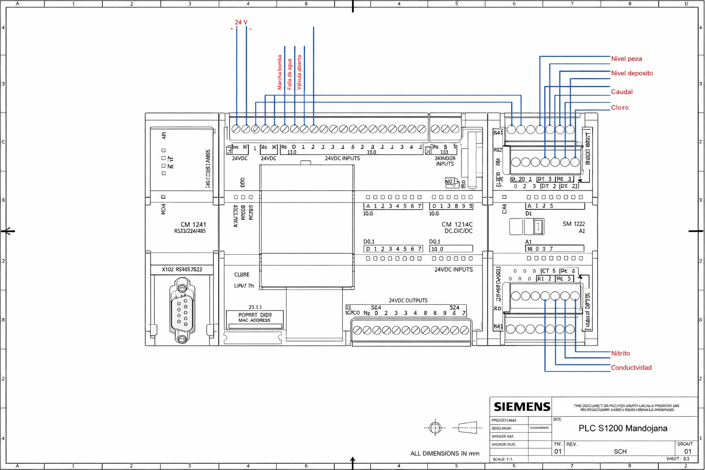
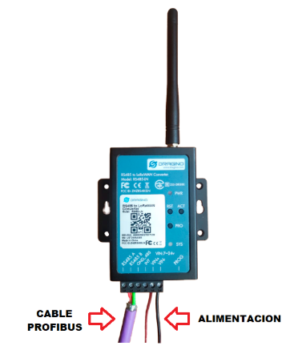
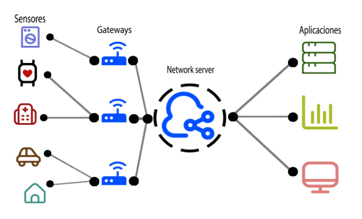

# Hardware and Communications

## Purpose of This Document

This document explains the main hardware components, communication interfaces, and protocol decisions used in the project.

The goal is not to reproduce a catalog-style list of devices, but to show how each component contributes to the complete monitoring pipeline and why the chosen communication stack is appropriate for distributed water pumping infrastructure.

---

## Technical Role of the Hardware Stack

At station level, the system had to achieve four practical functions:

1. Acquire field signals reliably
2. Expose those signals through an industrial communication interface
3. Convert station data into long-range wireless telemetry
4. Deliver the information to a centralized monitoring environment

Because of that, the hardware was selected as a layered stack rather than as isolated devices.

---

## Hardware Overview

The main hardware building blocks are:

* **Siemens S7-1200 PLC family (S7-1214C)** for local data acquisition and control
* **CM 1241 communication module** for serial communication support
* **Dragino RS485-LN** for RS-485 to LoRaWAN conversion
* **The Things Indoor Gateway (TTIG)** as the LoRaWAN gateway
* **Orange Pi 3 LTS** as the support platform for continuous Node-RED execution
* **24 V power supply infrastructure** for field-side industrial devices
* **additional I/O expansion modules where required by station signal count**

These devices are connected through a communication chain that links industrial control, serial data exchange, wireless telemetry, and application-layer monitoring.

---

## Recommended Introductory Figure

Place this figure near the top of the page, after the hardware overview.

```md
<p align="center">
  
</p>
<p align="center"><em>Figure 1. Main hardware components used in the station-side and central-side monitoring setup.</em></p>
```

---

## Station-Side Hardware

### Siemens S7-1214C PLC

The Siemens S7-1214C acts as the main industrial acquisition and control device at each pumping station.

Its role in the project is to:

* Read digital and analog process signals
* Organize the monitored variables into a consistent internal data structure
* Provide a robust industrial interface between field instrumentation and the telemetry layer
* Support future extension through additional programming and modular configuration

This was an appropriate choice for several reasons:

* It is industrial-grade hardware well suited to water infrastructure environments
* It supports integration with existing control logic
* It provides enough local capability for structured signal handling
* It can be programmed and configured through a standard engineering workflow using TIA Portal

In practical terms, the PLC is the component that turns raw operational conditions into structured data ready for transmission.

### PLC Programming and Engineering Environment

The PLC is programmed through its Ethernet interface using **TIA Portal V16**.

From a portfolio perspective, this matters because it shows that the project was not only about communications. It also required working with a standard industrial automation engineering environment for:

* PLC configuration
* Communication parameter setup
* Data-block design
* Variable mapping
* Integration testing

---

## Serial Communication Hardware

### CM 1241 Communication Module

The CM 1241 extends the PLC with serial communication capability and enables the RS-422/485 interface required by the project.

In this solution, its main purpose is to provide the physical and protocol-compatible bridge between the PLC and the Dragino RS485-LN converter.

This module is important because the project does not bypass industrial communications. Instead, it uses a conventional industrial serial layer before moving into wireless IoT transmission.

That design decision improves realism and compatibility in an industrial setting.

### Why RS-485 Was Relevant

RS-485 is widely used in industrial environments because it is simple, established, and reliable for serial communication over practical plant-level distances.

For this project, RS-485 was suitable because:

* It fits well with Modbus RTU communication
* It is common in industrial control integrations
* It supports a simple and robust connection between the PLC and the telemetry converter
* It avoids unnecessary architectural complexity at station level

---

## Telemetry Conversion Hardware

### Dragino RS485-LN

The **Dragino RS485-LN** is one of the most important components in the project because it performs the conversion from industrial serial communication to LoRaWAN telemetry.

Functionally, it acts as the boundary device between the OT world and the LPWAN/IoT world.

Its role includes:

* Querying the PLC through RS-485 / Modbus RTU
* Receiving the requested values from the PLC
* Building the payload to be transmitted
* Sending the resulting data through LoRaWAN
* Receiving downlink commands when required

In the local communication relationship, the Dragino acts as the **Modbus master**, while the PLC behaves as the **slave**.

This is a very relevant engineering detail because it defines how data exchange is initiated and how the polling logic works at station level.

### Why the Dragino RS485-LN Was a Good Fit

This device was especially useful in the project because it allows existing RS-485 devices to be integrated into a LoRaWAN architecture without redesigning the control layer from scratch.

That gives the solution several advantages:

* Reuse of industrial hardware already present or already suitable for the process
* Lower integration effort than replacing the PLC with a native IoT controller
* Cleaner separation between control logic and telemetry transport
* Easier scaling through a repeatable station-side pattern

### Configuration Approach

The RS485-LN can be configured through **AT commands**, typically by connecting it to a PC, and it can also receive remote instructions through **downlink commands** once connected to the LoRaWAN environment.

This dual configuration path is valuable because it supports both bench-level setup and remote operational adjustment.

---

## Gateway and Central Connectivity Hardware

### The Things Indoor Gateway (TTIG)

The gateway used in the project is the **The Things Indoor Gateway (TTIG)**.

Its role is to:

* Receive LoRa radio messages from Dragino devices
* Convert those radio messages into network traffic
* Forward the data to The Things Network (TTN) over internet connectivity

This makes the TTIG the radio-to-network bridge of the system.

### Why TTIG Was Appropriate

The TTIG was a practical choice for the pilot because it is relatively simple to configure and aligns well with a TTN-based LoRaWAN setup.

That said, it is also important to be precise about its constraints:

* It is closely tied to the TTN ecosystem
* It is convenient for pilot and prototype deployment
* It is less flexible than more open or industrial gateway alternatives if the architecture later migrates to a different private network-server strategy

That is worth mentioning in a portfolio because it shows realistic system judgment rather than presenting every component as universally optimal.

---

## Central Processing Support Hardware

### Orange Pi 3 LTS

The **Orange Pi 3 LTS** is used as the support computing platform that keeps Node-RED running continuously in the central environment.

Its role is straightforward but operationally important:

* Host the processing and visualization environment
* Provide a persistent runtime for MQTT reception and dashboard logic
* Keep the central monitoring layer available without depending on a general-purpose engineering workstation

This matters because the solution is not only a cloud integration concept. It also includes a dedicated runtime environment for operational monitoring.

---

## Power and Physical Integration Considerations

The field-side PLC and communication setup is powered through **24 V industrial power supplies**, which is consistent with typical industrial control installations.

From a portfolio perspective, this is useful to mention because it reinforces that the design was grounded in deployable hardware practice rather than only in software simulation.

At some stations, additional I/O capacity may also be required depending on the number of monitored signals. This introduces an important design consideration:

* The communications architecture must scale not only across stations
* It must also scale inside each station according to the local signal count and instrumentation mix

---

## Communication Stack Overview

The communication stack of the project can be summarized as follows:

**Field signals → PLC I/O → CM 1241 / RS-485 → Modbus RTU → Dragino RS485-LN → LoRa / LoRaWAN → TTIG → TTN → MQTT → Node-RED → ThingSpeak**

Each layer solves a different problem:

* **PLC and I/O** solve acquisition
* **RS-485 and Modbus RTU** solve local device communication
* **LoRa / LoRaWAN** solve long-range wireless transport
* **TTN** solves network-level device and packet management
* **MQTT** solves application-side message delivery
* **Node-RED and ThingSpeak** solve monitoring, storage, and operator-facing analysis

---

## Communication Protocols and Their Roles

### Modbus RTU

**Modbus RTU** is the local station-side protocol used between the Dragino device and the PLC.

Why it fits the project:

* It is a standard and widely understood industrial protocol
* It works naturally over RS-485
* It is appropriate for master-slave polling of structured registers
* It supports reliable exchange of process data in industrial contexts

What it contributes:

* Deterministic request/response structure
* Straightforward register-based data acquisition
* Compatibility with PLC-centered industrial designs

Its main limitation in this project context is that it is a traditional serial protocol with limited built-in security and modest communication speed compared with modern Ethernet-based alternatives. Still, for station-side telemetry polling, it is an appropriate and realistic choice.

### LoRa

**LoRa** is the physical long-range wireless technology used to carry station data toward the gateway.

Why it was chosen:

* Large coverage range
* Low operating cost
* Low power characteristics
* Good fit for geographically distributed infrastructure
* Suitability for a pilot that may later scale to multiple stations

In this project, LoRa is not just a generic wireless link. It is the enabling technology that makes remote pumping station coverage practical without expensive communications infrastructure.

### LoRaWAN

**LoRaWAN** is the network-layer protocol used above LoRa.

Why it matters:

* It provides device registration and network organization
* It supports scalable many-device architectures
* It separates end devices, gateways, network management, and applications
* It is much more appropriate than ad hoc direct LoRa links for centralized supervision

The project specifically adopts a **LoRaWAN architecture with an independent network server**, which improves centralized management and scalability.

### MQTT

**MQTT** is used after TTN to move telemetry into the application side of the solution.

Why it was chosen:

* Lightweight publish/subscribe model
* Suitable for IoT telemetry distribution
* Efficient for message-oriented integration
* Easy to connect with Node-RED flows and dashboards

In practical terms, MQTT is what makes the handoff between the LoRaWAN environment and the processing/visualization environment clean and flexible.

---

## Device and Protocol Relationship by Layer

A useful way to explain the system is to map each component to the communication layer it belongs to.

### Acquisition layer

* PLC I/O
* Local signal wiring

### Industrial communication layer

* CM 1241
* RS-485
* Modbus RTU

### Telemetry conversion layer

* Dragino RS485-LN

### LPWAN layer

* LoRa
* LoRaWAN
* TTIG gateway
* TTN

### Application messaging layer

* MQTT

### Monitoring and analytics layer

* Node-RED
* ThingSpeak
* Orange Pi runtime support

This layered framing is often clearer than describing the system as a single list of devices.

---

## Why This Communication Stack Was a Strong Engineering Choice

The combination of industrial serial communication and LPWAN telemetry was a good fit for the problem because it balances:

* **Industrial compatibility** at the station side
* **Low-cost long-range transmission** across remote assets
* **Centralized supervision** at the system level
* **Repeatability** across multiple pumping stations
* **Expandability** for future deployments

It is especially valuable as a portfolio example because it shows that the design did not rely on a single technology trend. Instead, it combined mature industrial communication and modern IoT networking in a coherent way.

---

## Main Practical Strengths

The strongest hardware and communications decisions in the project are:

* Use of industrial PLCs instead of fragile hobby-grade edge hardware at the station side
* A clean conversion point between Modbus/RS-485 and LoRaWAN
* A network architecture suited to more than one remote asset
* Efficient message delivery to Node-RED through MQTT
* A central runtime platform that keeps dashboards continuously available

---

## Main Practical Limitations

A credible technical portfolio should also acknowledge limitations.

Relevant limitations include:

* Modbus RTU is simple and reliable, but limited in speed and native security
* The TTIG is convenient for TTN pilots, but less flexible for future private-network migration
* The solution is designed for monitoring and supervisory visibility, not for fast closed-loop control
* Public-network dependence at the network-server level may not be ideal for a hardened production environment
* Security hardening can be expanded significantly in future iterations

---

## Suggested Visuals for This Page

### 1. PLC and communication module wiring diagram

Place this image after the Siemens PLC section.

```md
<p align="center">
  
</p>
<p align="center"><em>Figure 2. Example PLC-side wiring and module arrangement used in the Mandojana station setup.</em></p>
```

### 2. Dragino hardware installation and RS-485 connection

Place this image after the Dragino RS485-LN section.

```md
<p align="center">
  
</p>
<p align="center"><em>Figure 3. Hardware installation and RS-485 connection approach for the Dragino RS485-LN module.</em></p>
```

### 3. LoRaWAN element mapping diagram

Place this image after the communication stack overview.

```md
<p align="center">
  
</p>
<p align="center"><em>Figure 4. Mapping of end devices, gateway, network server, and application layer within the project.</em></p>
```

### 4. Node-RED dashboard programming screenshot

Place this image near the end of the document, in the monitoring layer section.

```md
<p align="center">
  
</p>
<p align="center"><em>Figure 5. Example of the Node-RED flow used to decode and route incoming station telemetry.</em></p>
```

---

## Conclusion

The hardware and communication design of this project is best understood as a practical bridge between industrial automation and remote telemetry.

The station-side layer uses reliable industrial control hardware. The communication layer uses standard serial industrial protocols. The telemetry layer converts that data into LoRaWAN traffic. The central layer turns received messages into dashboards and stored telemetry.

That combination is what gives the project its technical value: it is not only a monitoring concept, but a complete and deployable chain from field signals to centralized visibility.

---

## What Comes Next

After understanding the hardware and communication stack, the next step is to describe how the data actually moves through the system.

Continue with: [`data-flow.md`](data-flow.md)

---

## Navigation

* Back to the [English documentation index](README.md)
* Back to [Architecture](architecture.md)
* Switch to the [Spanish version](../es/hardware-and-communications.md)
