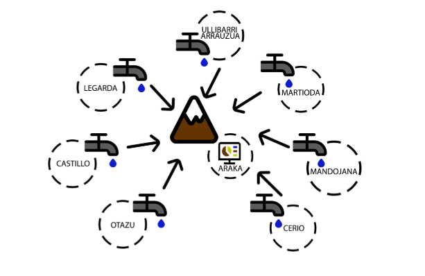
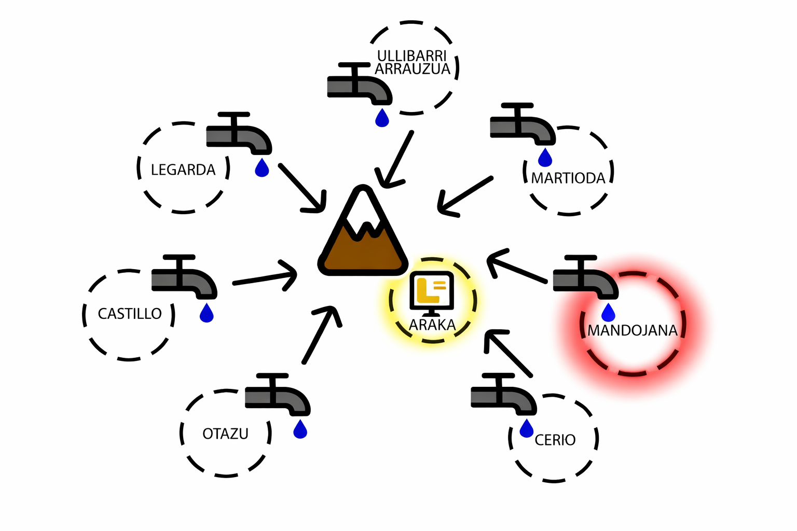

# Project Overview

## Introduction

This project presents a portfolio-oriented technical adaptation of a real industrial internship case focused on the remote monitoring of water pumping stations in Vitoria-Gasteiz.

The original challenge emerged from the operational need to supervise geographically distributed pumping facilities more efficiently. Instead of relying heavily on in-person inspections, the project explores how process variables from remote stations can be collected from the industrial control layer and transmitted to a centralized monitoring environment through an IoT-based communication architecture.

The result is a practical monitoring solution that combines industrial automation, long-range wireless communications, message-based integration, and cloud visualization tools.

---

## Industrial Context

Water pumping stations are critical assets in drinking water supply systems. Their correct operation directly affects service continuity, operational safety, and maintenance efficiency.

In this case, the monitored infrastructure is distributed across different remote locations. This creates several operational difficulties:

* Supervision is decentralized
* Technical staff may need to travel frequently to inspect equipment
* Fault detection may be delayed when there is no centralized visibility
* Process variables are harder to compare and analyze across stations
* Response times can worsen when operational information is fragmented

Because of this, the project was framed as a monitoring and data-centralization initiative aimed at improving visibility, reducing unnecessary travel, and enabling faster operational response.

---

## Problem Statement

The core problem addressed by this project is the lack of a simple and scalable mechanism to remotely monitor multiple pumping stations from a centralized point.

The monitoring solution had to satisfy a practical industrial need: acquire relevant field signals from existing control hardware, transmit them over long distances with low operating cost, and make the resulting data available in a form that operators could interpret quickly.

This is not only a connectivity problem. It is also a systems integration problem involving field instrumentation, PLC logic, industrial communication protocols, wireless telemetry, message routing, and data visualization.

---

## Project Goal

The main goal of the project was to design and validate a professional and efficient solution for the remote monitoring and management of water pumping stations, centralizing operational information in a control point located in Araka.

From a portfolio perspective, the value of the project lies in showing how a real industrial monitoring need can be translated into a coherent end-to-end architecture that connects the operational technology layer with modern IoT services and dashboard environments.

---

## Technical Objectives

The project was developed around several technical objectives:

1. Acquire operational data from pumping stations using industrial control hardware.
2. Configure a PLC-based acquisition layer capable of collecting relevant digital and analog signals.
3. Transmit field data through a long-range wireless communication solution suitable for remote infrastructure.
4. Integrate incoming telemetry into a centralized processing pipeline.
5. Visualize station status and process variables through dashboards.
6. Store and analyze transmitted data for monitoring and operational support.
7. Validate that the proposed solution is functional and scalable enough to support future expansion.

---

## Scope of the Solution

The scope of the project includes the design and integration of an end-to-end monitoring pipeline with the following layers:

* **Field acquisition layer:** collection of digital and analog signals from pumping stations
* **Industrial communication layer:** extraction and transfer of PLC data through RS-485 / Modbus
* **Wireless transmission layer:** long-range communication using LoRa / LoRaWAN
* **IoT network layer:** message handling through The Things Network (TTN)
* **Processing layer:** data decoding, transformation, and routing through MQTT and Node-RED
* **Visualization and storage layer:** dashboard display and cloud data storage through ThingSpeak

This repository focuses on the monitoring architecture and integration logic rather than on reproducing the full academic report.

---

## Monitored Variables and Station Coverage

The overall solution was conceived to support multiple pumping stations and a mix of digital and analog process signals.

Depending on the station, the monitored variables may include:

* Pump running status
* Pump fault signals
* Valve status
* Water shortage alarms
* Tank level signals
* Well level measurements
* Network pressure
* Suction pressure
* Flow measurements
* Chlorine-related process values

The project was planned with several stations in mind, while the pilot validation focused on a reduced set of locations.

---

## Pilot Validation Context

Although the architecture was conceived for broader deployment, the practical validation was carried out as a pilot implementation.

The solution was tested in the pumping station of Mandojana and in the water storage facilities of Araka. This pilot stage served to verify that the proposed architecture was technically valid and functionally feasible before a wider rollout to additional stations.

This is an important point in the portfolio version of the project: the emphasis is not on claiming a full production deployment, but on demonstrating a technically sound pilot with clear expansion potential.

---

## Why This Architecture Was Relevant

The proposed architecture addressed key operational needs:

* It enabled centralized visibility across remote assets
* It reduced dependence on manual supervision
* It used long-range communication suitable for geographically dispersed infrastructure
* It supported near real-time monitoring through intermediate refresh intervals
* It allowed simultaneous capture of multiple stations
* It created a scalable basis for future expansion

This makes the project especially relevant as an example of OT/IoT integration in an industrial environment.

---

## Main Technologies Used

The project combines several technologies that play different roles in the monitoring pipeline:

* **Siemens S7-1214 PLCs** for field data acquisition
* **CM 1241 communication module** for industrial communication support
* **Dragino RS485-LN** for RS-485 to LoRaWAN telemetry transmission
* **LoRa / LoRaWAN** for long-range wireless communications
* **The Things Network (TTN)** as the LoRaWAN network layer
* **MQTT** for message exchange
* **Node-RED** for data processing and dashboard logic
* **ThingSpeak** for storage, visualization, and alert-oriented analysis
* **Orange Pi** as a support computing environment for the monitoring stack

---

## Engineering Value of the Project

As a portfolio project, this work demonstrates several engineering capabilities:

* understanding a real operational problem in industrial infrastructure
* designing a complete telemetry architecture instead of an isolated component
* integrating control hardware with wireless communications and software platforms
* balancing practicality, cost, scalability, and reliability
* translating field requirements into an end-to-end monitoring solution
* documenting technical work in a concise and professional way

---

## Suggested Visuals for This Page

### 1. System context image

Suggested location near the top of the document, after the introduction.

```md

*Figure 1. General context of the distributed pumping stations considered in the project.*
```

### 2. High-level architecture image

Suggested location after the “Scope of the Solution” section.

```md

*Figure 2. High-level architecture of the remote monitoring solution.*
```

### 3. Pilot validation image

Suggested location after the “Pilot Validation Context” section.

```md

*Figure 3. Pilot validation context in Mandojana and Araka.*
```

---

## What Comes Next

After understanding the project context and scope, the next step is to examine the system architecture in detail.

Continue with: [`architecture.md`](architecture.md)

---

## Navigation

* Back to the [English documentation index](README.md)
* Back to the [repository root README](../../README.md)
* Switch to the [Spanish version](../es/project-overview.md)
