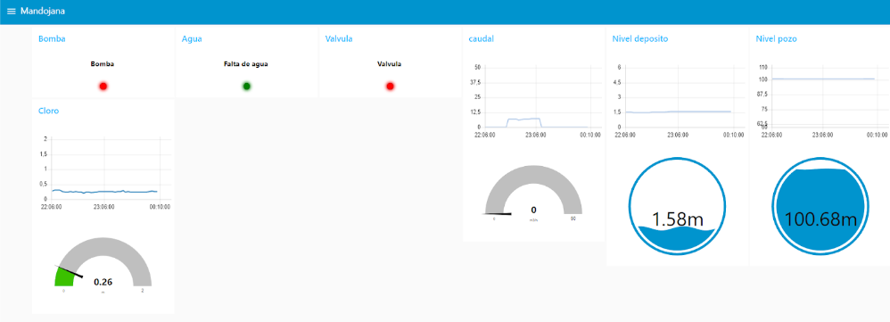

# Validation and Results

## Purpose of This Document

This document explains how the solution was validated and what results were observed during the pilot stage.

In this portfolio-oriented version of the project, the goal is not to present the validation as a formal laboratory benchmark with exhaustive numerical KPIs. Instead, the objective is to show how the architecture was progressively tested, what technical capabilities were demonstrated, and why the pilot can be considered successful from an engineering perspective.

---

## Validation Philosophy

The system was validated as a **functional industrial pilot**, not as a fully scaled production rollout.

That distinction matters.

The key question was not whether every future station had already been deployed, but whether the proposed architecture had been demonstrated as technically valid and operationally useful in a real monitoring context.

The validation therefore focused on proving that the following chain worked reliably enough for the intended use case:

* Field signal acquisition
* PLC data structuring
* Modbus communication with the telemetry converter
* LoRaWAN transmission to TTN
* Payload decoding and message delivery
* Node-RED dashboard monitoring in Araka
* ThingSpeak-based storage and analysis

---

## Recommended Main Figure

Place this image near the top of the page, after the validation philosophy section.

```md
<p align="center">
  
</p>
<p align="center"><em>Figure 1. Validation scope of the pilot, centered on Mandojana station and the central monitoring environment in Araka.</em></p>
```

---

## Pilot Validation Context

Although the architecture was conceived for a broader network of pumping stations, the implemented validation was carried out as a pilot.

The pilot focused on:

* **Mandojana** as the station-side implementation case
* **Araka** as the central reception and supervision point

This is one of the most important points to communicate clearly in the portfolio.

The project should not be presented as if every planned station had already been deployed with the same maturity level. The real achievement is that the complete monitoring pattern was implemented and validated on a representative pilot setup, demonstrating that the architecture is functional and expandable.

---

## What Was Actually Validated

The validation did not depend on a single final test. It was built as a progressive sequence of checks across the full telemetry chain.

The main validation targets were:

### 1. Station-side acquisition validity

The PLC had to acquire and structure the monitored station variables correctly.

### 2. Serial communication validity

The RS-485 / Modbus RTU link between the PLC and the Dragino RS485-LN had to return the expected values.

### 3. Wireless transmission validity

The Dragino payload had to reach TTN through the LoRaWAN path.

### 4. Decoding validity

The received payload had to be interpreted correctly so that the central monitoring layer worked with meaningful variables instead of raw bytes.

### 5. Dashboard validity

Node-RED had to display the station state in a usable way for remote supervision.

### 6. Storage and analysis validity

ThingSpeak had to receive and store the processed telemetry so that historical review and alert-oriented extensions were possible.

### 7. Operational usefulness

The overall system had to prove that it could centralize supervision and reduce dependence on local-only visibility.

---

## Validation Sequence

A strong way to understand the results is to describe the validation in stages.

### Stage 1. Connectivity and network-side validation

Before full field integration, the project validated the Dragino-to-TTN path.

This confirmed that:

* The device could be registered successfully
* Uplink communication could be established
* The selected LoRaWAN approach was viable for the project

### Stage 2. Isolated telemetry tests

Signal-generator tests were used before final PLC integration.

This was valuable because it allowed the team to isolate problems and verify that the transmission chain behaved correctly before adding the complexity of full industrial data acquisition.

This stage confirmed that:

* The telemetry link could carry the generated signals
* Initial configuration issues could be identified in a controlled setup
* The project could move toward integrated testing with greater confidence

### Stage 3. PLC + Dragino prototype validation

Once the isolated tests were satisfactory, the PLC and Dragino were tested together.

This stage confirmed that:

* The PLC could expose the required data structure
* The Dragino could poll the PLC through Modbus RTU
* The payload could be built from the expected register values
* Integrated station-side transmission was feasible

### Stage 4. Central-side reception validation

The reception side was then validated through MQTT, TTN decoding, and later Node-RED-based reception.

This stage confirmed that:

* The payload could be decoded correctly
* The values could be routed into the central supervision layer
* The practical change toward Node-RED as the main reception environment was viable

### Stage 5. Pilot operation validation

Finally, the complete station-to-central chain was tested in the pilot context between Mandojana and Araka.

This was the most important validation step because it demonstrated that the solution worked as an end-to-end monitoring system rather than as a disconnected set of subsystems.

---

## Core Validation Criteria

From an engineering point of view, the pilot can be judged through a set of practical criteria.

### End-to-end functionality

The most important criterion was whether the complete telemetry chain worked from field signal to dashboard.

### Data interpretability

It was not enough for bytes to arrive. The final variables had to be readable and meaningful for operators.

### Monitoring suitability

The solution had to support remote supervision at refresh intervals appropriate for operational monitoring.

### Repeatability

The architecture had to be suitable for reuse in additional stations.

### Integration quality

The different layers had to work together without requiring unrealistic manual intervention at every step.

By these criteria, the pilot can be considered successful.

---

## Observed Results

## 1. The architecture proved functionally valid

The strongest overall result is that the proposed architecture was validated as **fully functional in pilot conditions**.

The project demonstrated that it was possible to:

* Acquire station data using industrial PLC hardware
* Transmit that data through a LoRaWAN-based telemetry path
* Centralize incoming information in Araka
* Visualize the station state through Node-RED dashboards
* Extend the solution with ThingSpeak for storage and analysis

This matters because the project was not left at design level. The architecture was actually exercised in a realistic operating context.

---

## 2. LoRa / LoRaWAN was confirmed as an appropriate communication choice

One of the key design hypotheses of the project was that long-range, low-cost wireless communication would be suitable for geographically distributed pumping stations.

The pilot results support that decision.

The communication chain through Dragino, TTIG, and TTN demonstrated that the selected LoRaWAN approach was viable for this use case and aligned with the original design requirements of:

* Long-range coverage
* Low operating cost
* Support for multiple remote assets
* Expandability beyond the pilot case

This is an important result because it validates not only implementation, but also the earlier architectural decision-making.

---

## 3. Node-RED proved effective as the operational monitoring layer

Another major result was the successful use of Node-RED as the central monitoring environment.

This became especially important after the project adapted to the practical limitation of not being able to rely on a more direct Ethernet-connected PLC reception path in Araka.

The Node-RED layer demonstrated that it could:

* Receive telemetry through MQTT
* Route decoded values correctly
* Provide real-time dashboards
* Support station-level visibility in a form that operators can use quickly

From a portfolio point of view, this is one of the most valuable outcomes, because it shows that the project adapted to real infrastructure constraints without losing functionality.

---

## 4. Industrial hardware integration was validated successfully

The combination of the Siemens PLC, CM 1241, Dragino RS485-LN, TTIG, and Orange Pi was validated as a coherent stack.

This is important because the project depended on multiple hardware layers working together:

* Industrial acquisition hardware
* Serial communication hardware
* Wireless telemetry hardware
* Gateway and network infrastructure
* Central processing hardware

The pilot showed that this heterogeneous integration was feasible and operationally useful.

---

## 5. The pilot demonstrated real-time supervisory visibility

The results indicate that the solution supports **remote supervisory monitoring** with update intervals aligned with the intended monitoring rhythm of roughly **3 to 5 minutes**.

This is an important nuance.

The project is not a high-speed control system, and it should not be presented as one. Its success lies in enabling centralized supervision, improving visibility, and supporting faster operational response compared with decentralized manual monitoring.

Within that intended scope, the pilot result is positive.

---

## 6. ThingSpeak added useful historical and analytical value

The pilot also demonstrated that the system could be extended beyond immediate dashboard visibility.

By publishing processed values to ThingSpeak, the project gained:

* Historical storage
* Trend visualization
* Additional analysis capabilities
* A path toward alarms and event-oriented monitoring

This means the pilot was not limited to instantaneous telemetry display. It also established a foundation for deeper operational analysis.

---

## Suggested Dashboard Result Figure

Place this image after the Node-RED result section.

```md
<p align="center">
  
</p>
<p align="center"><em>Figure 2. Pilot dashboard used in Araka to supervise the incoming telemetry from the validated station setup.</em></p>
```

---

## Station-Level Result Example

A useful way to make the results concrete is to explain what the pilot allowed operators to see in practice.

For the validated station context, the dashboards could present variables such as:

* Pump operating state
* Water shortage alarms
* Valve state
* Tank and well level values
* Flow-related values
* Chlorine-related process values

This is important because it shows that the system was not merely transmitting a generic payload. It was exposing operationally meaningful process information.

---

## Results Against Original Design Requirements

The validation results align well with the main design requirements defined for the project.

### Long-range, low-cost communication

Validated positively through the LoRaWAN pilot path.

### Use of industrial equipment

Validated positively through the PLC-centered acquisition and communication stack.

### SCADA-friendly central supervision

Validated positively through Node-RED-based dashboards in Araka.

### Multi-station architectural potential

Partially validated: the architecture was designed for several stations, but the pilot was functionally validated on a reduced subset.

### Intermediate refresh times

Validated positively for supervisory monitoring.

### Sufficient signal handling

Validated positively in the implemented station case, including both digital and analog values.

### Robustness and scalability

Validated at pilot level, with expansion potential clearly established but not yet fully deployed across all intended stations.

---

## What the Results Mean from a Portfolio Perspective

From a technical portfolio standpoint, the most important result is not a single numerical metric.

It is that the project demonstrates the ability to:

* Define realistic design requirements
* Choose an appropriate communication architecture
* Integrate industrial hardware with IoT networking
* Adapt implementation plans to real deployment constraints
* Validate a complete end-to-end monitoring system in pilot conditions
* Communicate the engineering value of the solution clearly

That makes the project a strong example of practical OT/IoT systems engineering.

---

## What Was Not Fully Demonstrated Yet

A credible validation document should also state the limits of the observed results.

The pilot did **not** fully demonstrate:

* Large-scale deployment across every planned station
* Long-term production operation under all seasonal and environmental conditions
* Hard real-time control performance
* Enterprise-grade cybersecurity hardening
* Exhaustive quantitative benchmarking such as packet-loss statistics, uptime measurements, or long-duration field reliability studies

Mentioning this improves the credibility of the portfolio because it avoids overstating what the pilot proved.

---

## Main Strengths Confirmed by Validation

The pilot confirmed several important strengths:

* The architecture works end to end
* The selected communication stack is viable
* Node-RED is effective for centralized supervision
* The solution can handle meaningful industrial variables
* The design is suitable for further expansion
* The system improves remote visibility compared with decentralized manual supervision

---

## Main Remaining Risks and Open Points

Validation also leaves some open engineering questions for future work.

Relevant next-step concerns include:

* Migration from a pilot/public network-server context toward a more production-oriented setup if needed
* Stronger security hardening
* Broader rollout across additional stations
* Longer field validation over extended periods
* Deeper alarm logic, analytics, and maintenance-oriented automation

These are not signs of project weakness. They are natural next steps after a successful pilot.

---

## Suggested ThingSpeak Result Figure

Place this image after the ThingSpeak result section.

```md
<p align="center">
  
</p>
<p align="center"><em>Figure 3. Example of the historical visualization and alert-oriented analysis enabled by the ThingSpeak integration.</em></p>
```

---

## Suggested Requirement-Validation Matrix Figure

Place this image near the end of the document, before the conclusion.

```md
<p align="center">
  
</p>
<p align="center"><em>Figure 4. Summary view of how the pilot results relate to the original system design requirements.</em></p>
```

---

## Conclusion

The validation results show that the project achieved its central technical goal: proving that a distributed water pumping monitoring system based on industrial PLC acquisition, Modbus communication, LoRaWAN telemetry, MQTT messaging, Node-RED dashboards, and ThingSpeak storage can function as a coherent remote supervision solution.

The pilot between Mandojana and Araka demonstrated that the architecture is not only conceptually sound, but operationally viable within the intended scope of supervisory monitoring.

The most honest engineering conclusion is this:

* The pilot successfully validated the architecture
* The solution is functionally useful
* The project established a repeatable pattern for future deployment
* Broader scale-up and hardening remain the logical next steps

That makes the results strong, credible, and highly suitable for a technical portfolio.

---

## What Comes Next

After the validation results, the next document should focus on practical operating notes, deployment considerations, and implementation details that are useful when reproducing or extending the system.

Continue with: [`deployment-notes.md`](deployment-notes.md)

---

## Navigation

* Back to the [English documentation index](README.md)
* Back to [Implementation](data-flow.md)
* Switch to the [Spanish version](../es/validation-and-results.md)
